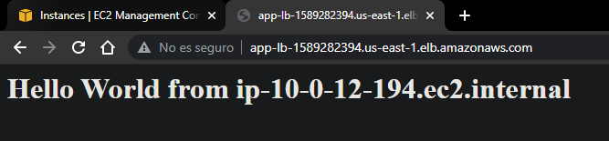
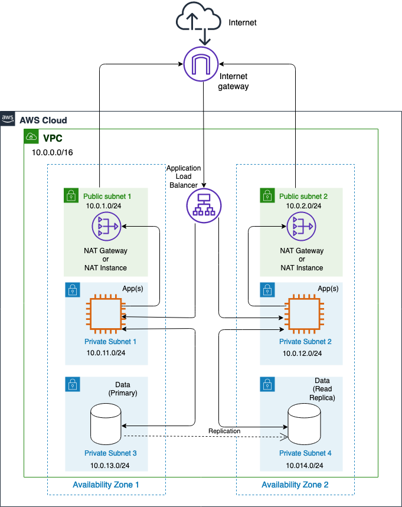
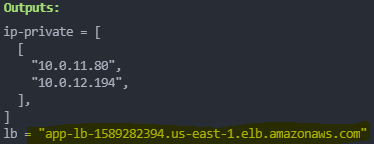
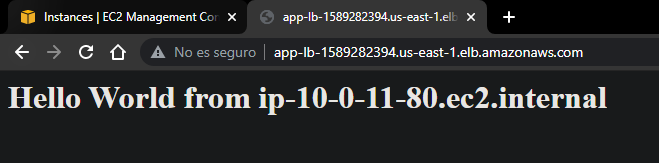

# Terraform AWS VPC 3 Tier Achitecture

## Descripcion

- La Arquitectura sirve para el balanceo de carga para un sitio web simple que muestra el hostname al cual se esta balanceando la carga
- Cuando se coloque la direccion DNS del ALB en un navegador se podra observar si la carga se esta distribuyendo entre las dos instancias, mediante la impresion del hostname en la pagina web de la siguiente forma



La Arquitectura esta diseñada e implementada en 2 AZs y consta de los siguientes recursos:

- 1 Internet Gateway
- 2 Subnets publicas
- 2 Subnets privadas para instancias EC2
- 2 Subnets privadas para bases de datos
- 2 NAT Gateways en las subnets publicas para que las instancias en las subnets privadas se puedan conectar a internet
- 1 Application Load Balancer



## Uso
- Para crear la infraestrutura debemos ejecutar los siguientes comandos:
```t
terraform init
terraform validate 
terraform plan
terraform apply -auto-approve
```

# ARCHIVOS

## 01 - Vpc

```t
resource "aws_vpc" "my-vpc" {
  cidr_block = var.cidr

  tags = {
    Name = "${var.my-vpc}"
  }
}
```
## 02 - Vpc Vars

```t
variable "my-vpc" {
  type    = string
  default = "my-vpc"
}

variable "cidr" {
  type    = string
  default = "10.0.0.0/16"
}

variable "azs" {
  type    = list(string)
  default = ["us-east-1a", "us-east-1c"]
}
```

## 03 - Subnets

```t
# PUBLIC SUBNETS
resource "aws_subnet" "pub-subnets" {
  vpc_id                  = aws_vpc.my-vpc.id
  count                   = length(var.pub-subnets)
  availability_zone       = element(var.azs, count.index)
  cidr_block              = element(var.pub-subnets, count.index)
  map_public_ip_on_launch = true

  tags = {
    Name = "pub-subnet-${count.index}"
  }
}

# PRIVATE SUBNETS
resource "aws_subnet" "priv-subnets" {
  vpc_id                  = aws_vpc.my-vpc.id
  count                   = length(var.priv-subnets)
  availability_zone       = element(var.azs, count.index)
  cidr_block              = element(var.priv-subnets, count.index)
  map_public_ip_on_launch = false

  tags = {
    Name = "priv-subnet-${count.index}"
  }
}
```
 
## 04 - Subnets Vars

```t
variable "pub-subnets" {
  type    = list(string)
  default = ["10.0.1.0/24", "10.0.2.0/24"]
}

variable "priv-subnets" {
  type = list(string)
  default = [
    "10.0.11.0/24",
    "10.0.12.0/24",
    "10.0.13.0/24",
    "10.0.14.0/24",
  ]
}
```
## 05 - Internet Gateway

```t
resource "aws_internet_gateway" "i-gateway" {
  vpc_id = aws_vpc.my-vpc.id

  tags = {
    Name = "my-igtw"
  }
}
```
## 06 - Nat Gateways

```t
# ------- PUBLIC NAT GATEWAY ----------
# You create a public NAT gateway in a public subnet and must 
# associate an elastic IP address with the NAT gateway at creation
resource "aws_eip" "eips" {
  count      = length(var.azs)
  vpc        = true
  depends_on = [aws_internet_gateway.i-gateway]
}

resource "aws_nat_gateway" "nat-gtw" {
  count             = length(var.pub-subnets)
  allocation_id     = aws_eip.eips[count.index].id
  subnet_id         = aws_subnet.pub-subnets[count.index].id
  connectivity_type = "public"
  depends_on        = [aws_internet_gateway.i-gateway]

  tags = {
    Name = "nat-gwt-${count.index}"
  }
}
```

## 07 - Route Tables

```t
# TABLE FOR PUBLIC SUBNETS
resource "aws_route_table" "rt-pub" {
  vpc_id = aws_vpc.my-vpc.id
}

resource "aws_route" "pub-route" {
  route_table_id         = aws_route_table.rt-pub.id
  destination_cidr_block = "0.0.0.0/0" #all IPV4 addresses
  gateway_id             = aws_internet_gateway.i-gateway.id
}

resource "aws_route_table_association" "as-pub" {
  count          = length(var.pub-subnets)
  subnet_id      = aws_subnet.pub-subnets[count.index].id
  route_table_id = aws_route_table.rt-pub.id
}

# TABLE FOR PRIVATE SUBNETS
resource "aws_route_table" "rt-priv" {
  count  = "${length(var.azs)}"
  vpc_id = aws_vpc.my-vpc.id
}

resource "aws_route" "priv-route" {
  count                   = "${length(var.azs)}"
  route_table_id          = aws_route_table.rt-priv[count.index].id
  destination_cidr_block  = "0.0.0.0/0" #all IPV4 addresses
  nat_gateway_id          = aws_nat_gateway.nat-gtw[count.index].id 
}

resource "aws_route_table_association" "as-priv" {
  count          = "${length(var.azs)}"
  subnet_id      = aws_subnet.priv-subnets[count.index].id
  route_table_id = aws_route_table.rt-priv[count.index].id
}

```

## 08 - Security Groups

```t
locals {
  ports = [22, 80]
}

resource "aws_security_group" "allow_tls" {
  name        = "allow_tls"
  description = "Allow TLS inbound traffic"
  vpc_id      = aws_vpc.my-vpc.id

  dynamic "ingress" {
    for_each = local.ports
    content {
      description      = "Allow ssh-http"
      from_port        = ingress.value
      to_port          = ingress.value
      protocol         = "tcp"
      cidr_blocks      = ["0.0.0.0/0"]
      ipv6_cidr_blocks = ["::/0"]
    }
  }

  egress {
    from_port        = 0
    to_port          = 0
    protocol         = "-1"
    cidr_blocks      = ["0.0.0.0/0"]
    ipv6_cidr_blocks = ["::/0"]
  }

  tags = {
    Name = "allow_tls"
  }
}
```
## 09 - Ec2 Instances

- En la parte del `USER_DATA` se hace referencia al archivo `http.sh`

```t
resource "aws_instance" "my_instances" {
  count             = length(var.azs)
  ami               = "ami-0aeeebd8d2ab47354"
  instance_type     = "t2.micro"
  availability_zone = element(var.azs, count.index)
  subnet_id         = aws_subnet.priv-subnets[count.index].id
  vpc_security_group_ids = [aws_security_group.allow_tls.id]
  user_data         = file("http.sh")

  tags = {
    Name = "instance-${element(var.azs, count.index)}"
  }
}
```
## Contenido del archivo -> http.sh <-
```bash
#!/bin/bash
sudo yum update -y
sudo yum install httpd -y
sudo systemctl enable httpd
sudo systemctl start httpd
echo "<h1>Hello World from $(hostname -f)</h1>" > /var/www/html/index.html
```
## 10 - Application Load Balancer

```t
resource "aws_lb" "app-lb" {
  name               = "app-lb"
  internal           = false
  load_balancer_type = "application"
  security_groups    = [aws_security_group.allow_tls.id]
  subnets            = ["${aws_subnet.pub-subnets[0].id}", "${aws_subnet.pub-subnets[1].id}"]

}

resource "aws_lb_target_group" "tg-group" {
  name     = "tg-group"
  port     = 80
  protocol = "HTTP"
  vpc_id   = aws_vpc.my-vpc.id
 
}

resource "aws_lb_target_group_attachment" "attach-instance" {
  count             = 2
  target_group_arn  = aws_lb_target_group.tg-group.arn
  target_id         = "${element(split(",", join(",", aws_instance.my_instances[*].id)), count.index)}"
  port              = "80"
}

resource "aws_lb_listener" "lb-listener" {
  load_balancer_arn = aws_lb.app-lb.arn
  port              = "80"
  protocol          = "HTTP"

  default_action {
    type             = "forward"
    target_group_arn = aws_lb_target_group.tg-group.arn
  }
}
```
## 11 - Outputs

```t
output "ip-private" {
  value = [aws_instance.my_instances[*].private_ip]
}

output "lb" {
  value = aws_lb.app-lb.dns_name
}
```

# RESULTADOS

Una vez ejecutado el comando `terraform apply -auto-approve` y cuando una vez terminada la creacion de la infraestrutura, se obtienen los `OUTPUTS`, especialmente las IPS privadas de las instancias EC2 y el DNS de ALB



Ingresamos a un navegador y colocamos en la barra de direcciones el DNS del ALB para comprobar el funcionamiento




